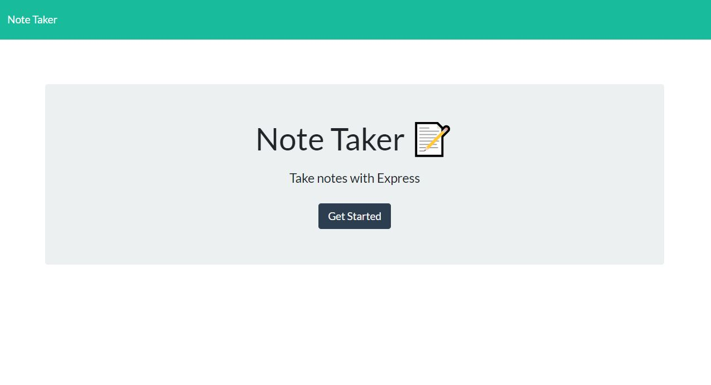
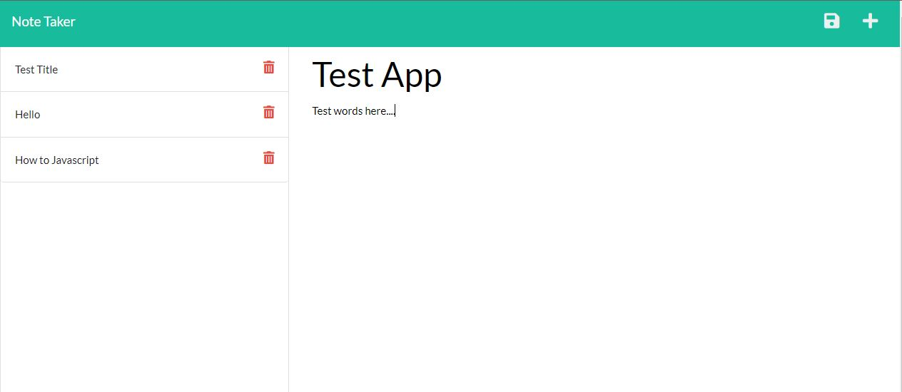

# NoteTakerApplication

## Description

- A Note Taker App to help you easily jot down quick notes and save them fo later.

## Description

- Opening the Note Taker page you are presented with a landing page with a link to a notes page
- If you click on the link to the notes page you are taken to a page with existing notes listed in the left-hand column, plus empty fields to enter a new note title and the note’s text in the right-hand column.
- When you enter a new note title and the note’s text then a Save icon appears in the navigation at the top of the page
- When you click on the Save icon then the new note I have entered is saved and appears in the left-hand column with the other existing notes.
- If you click on an existing note in the list in the left-hand column that note appears in the right-hand column.
- When you click on the Write icon in the navigation at the top of the page then you are presented with empty fields to enter a new note title and the note’s text in the right-hand column.

## Table of Contents

- [Usage](#usage)
- [Credits](#credits)
- [License](#license)

## Usage

Heroku URL: https://calm-shelf-89606.herokuapp.com/

## Credits

Heroku
geeksforgeeks.org
mdn web docs

## License

MIT License

Copyright (c) [2022] [Isaac Falcon]

Permission is hereby granted, free of charge, to any person obtaining a copy
of this software and associated documentation files (the "Software"), to deal
in the Software without restriction, including without limitation the rights
to use, copy, modify, merge, publish, distribute, sublicense, and/or sell
copies of the Software, and to permit persons to whom the Software is
furnished to do so, subject to the following conditions:

The above copyright notice and this permission notice shall be included in all
copies or substantial portions of the Software.

THE SOFTWARE IS PROVIDED "AS IS", WITHOUT WARRANTY OF ANY KIND, EXPRESS OR
IMPLIED, INCLUDING BUT NOT LIMITED TO THE WARRANTIES OF MERCHANTABILITY,
FITNESS FOR A PARTICULAR PURPOSE AND NONINFRINGEMENT. IN NO EVENT SHALL THE
AUTHORS OR COPYRIGHT HOLDERS BE LIABLE FOR ANY CLAIM, DAMAGES OR OTHER
LIABILITY, WHETHER IN AN ACTION OF CONTRACT, TORT OR OTHERWISE, ARISING FROM,
OUT OF OR IN CONNECTION WITH THE SOFTWARE OR THE USE OR OTHER DEALINGS IN THE
SOFTWARE.

---

## Badges

